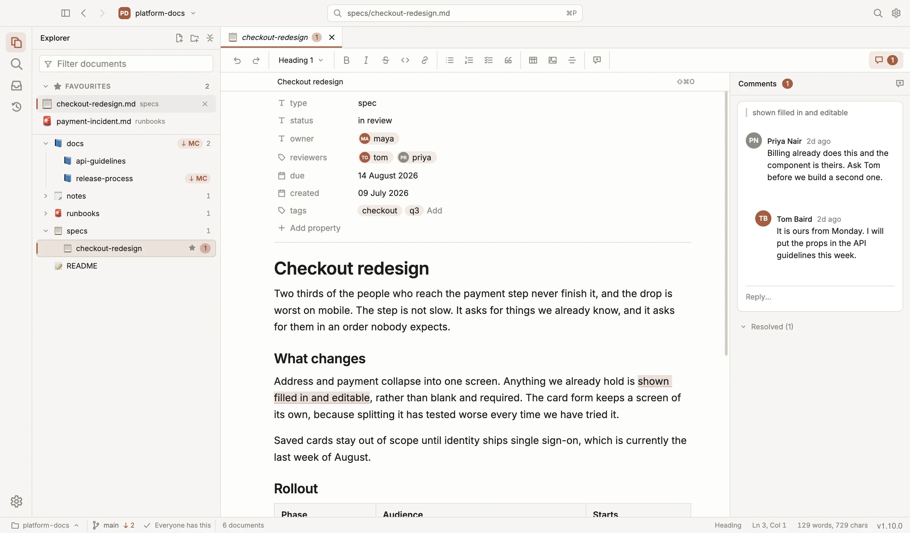
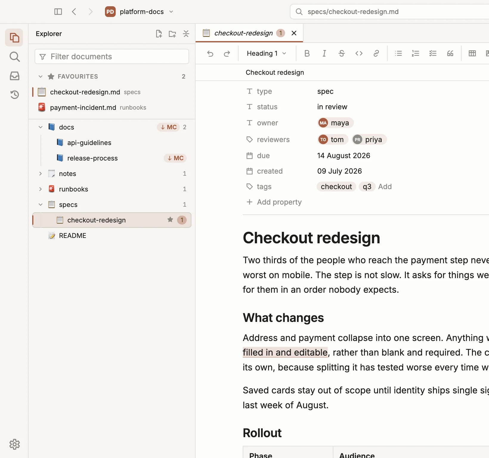
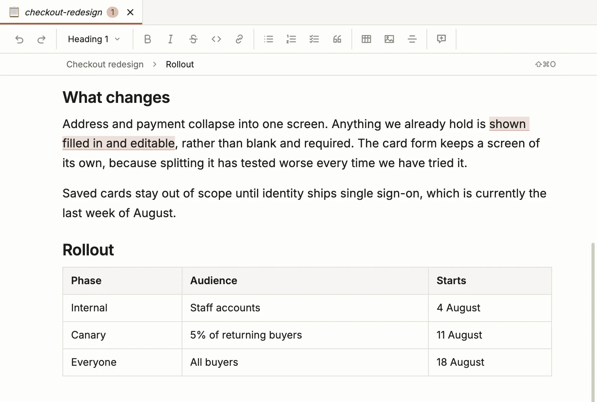
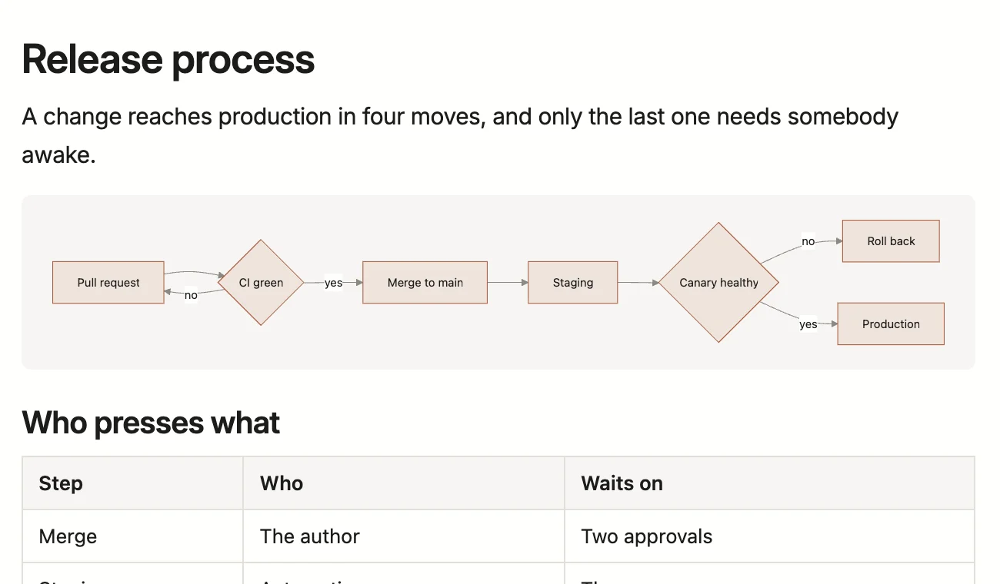
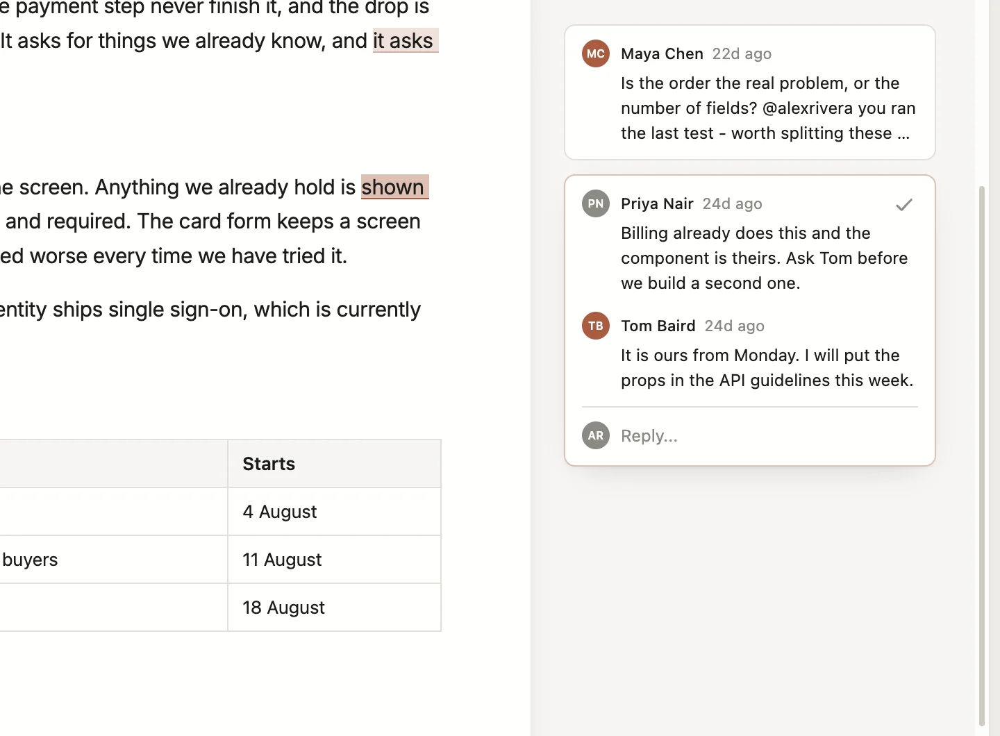
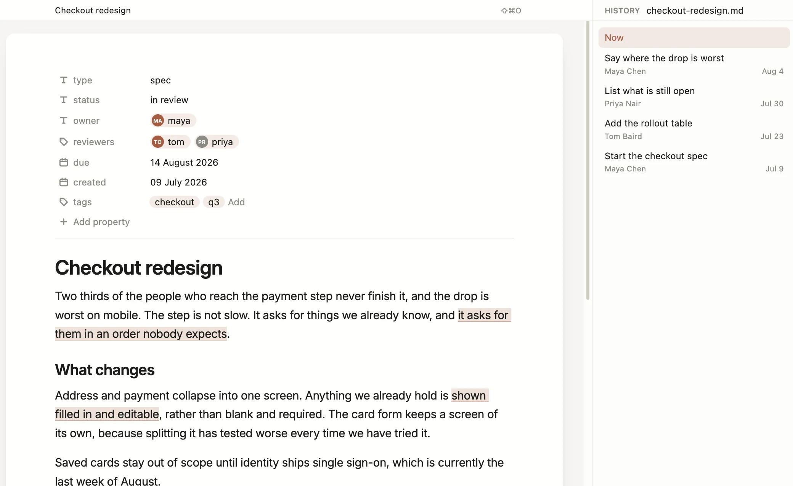
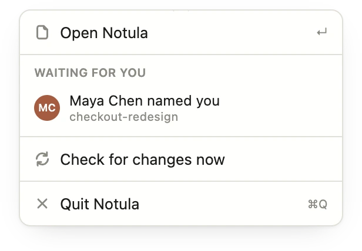
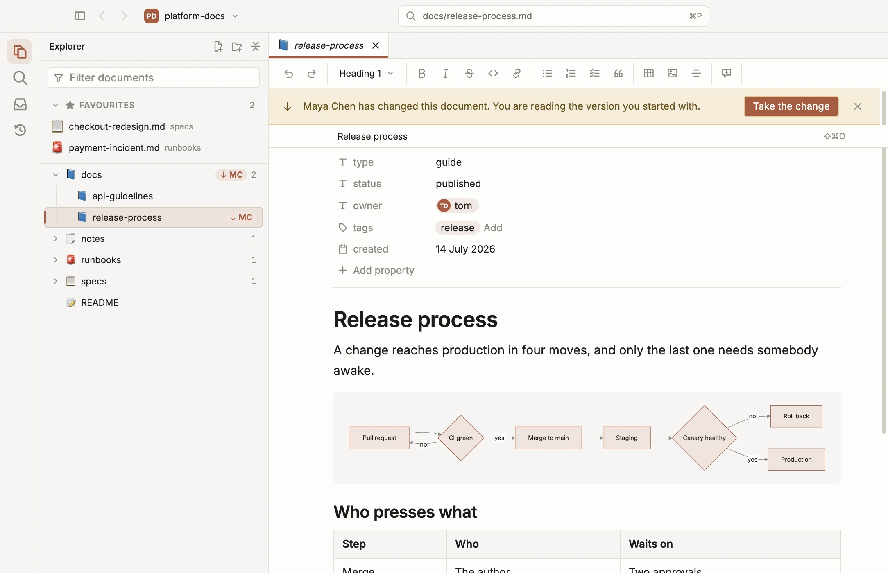
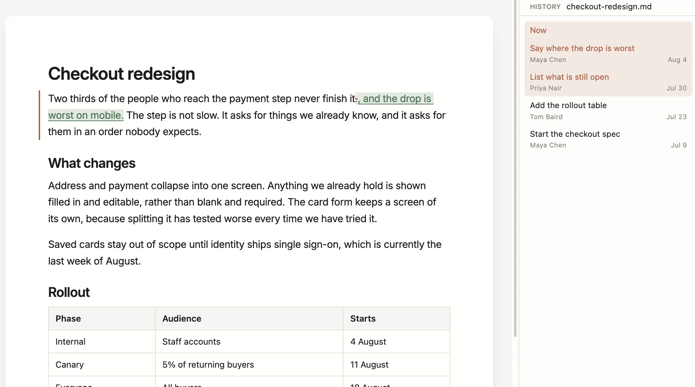

# Notula

**WYSIWYG Markdown editor. For the docs in your git repo.**

Docs as code, without having to be a coder. Like Google Docs, on files that never leave the repository: comment on a passage, reply, resolve, browse the docs in a tree, and publish without anybody being shown a `rebase`.



**[Download the latest release](https://github.com/anetrebskii/notula-releases/releases/latest)** for macOS or Windows. Free, and it stays free. No account, no server.

This repository holds the builds and the release notes. The source is private while the app is this young. The downloads are not, and every build carries the release notes for what changed. The site is [notula.org](https://notula.org).

## Only the documentation, none of the code



Open a repository with thousands of source files and get a clean tree of Markdown. Folders with no documents in them never appear. Notula asks git for the file list rather than walking the disk, so a large repository opens as fast as a small one, and `.gitignore` is respected for free.

## WYSIWYG, not live preview



No Markdown syntax, ever. No hashes, no asterisks, no table pipes, not even on the line your cursor is on. What lands on disk is ordinary Markdown that reviews in a normal pull request.

## Mermaid diagrams draw themselves



A mermaid block is a picture in the document, not a wall of arrows and brackets. On disk it is still the same fenced block, so it draws on the host too.

## The comments you actually miss



Select a passage, leave a comment, reply, resolve. A conversation is committed next to the document it is about, so it arrives with the clone and outlives every account.

- Documents stay clean. No invisible anchors, no block IDs, no HTML comments.
- Anchored by the quoted passage and its context, following the W3C Web Annotation model.
- An append-only log with a union merge driver, so two people commenting at once cannot conflict.

## Git, without teaching git



Every version of the document is there to read and to bring back. Nobody is ever shown a rebase, a stash, or the words detached HEAD.

## You are never the last to know

and nothing ever changes under your cursor.

### Somebody named you

Your machine tells you, with the sentence they wrote.



- Clicking it opens the document at that paragraph, not at the top.
- It keeps watching repositories you do not have open, with the window closed.
- Two at a time arrive on their own; more than that arrive together, so they stay read.

### Something changed

And you did not have to go and ask.



- Every document the rest of the team has moved on is marked in the tree, with who moved it and when.
- Your own unpublished work is marked the same way, so nothing waits in a drawer you forgot about.
- It looks every thirty seconds while you are working, and every few minutes while you are not.
- All of it is read from the fetched branch, so the document on screen is still exactly what you left until you take the change.

## Navigates like a browser

Follow a link and the document opens in the same pane. Back and forward return you to exactly where you were, scroll position included.

- Every pane keeps its own trail, so a reference held open in a split is never disturbed.
- Relative links between documents resolve the way they do on the host.
- Non-Markdown link targets open read-only instead of being handed to another app.

## A one-character edit stays a one-character diff



Notula writes back only what changed. Opening a document and saving it without editing produces a byte-identical file, and across 6,000 real documents 96.4% of blocks survive an edit untouched.

## Your agent gets a briefing, not a guess

Notula writes down how the workspace works, and points Claude Code at it. It writes `notula-agents.md` describing the document types, the fields, the layout and the commands, and borrows three lines of your `CLAUDE.md` to point at it. It never overwrites what you wrote there.

- Renaming a document is `notula docs move`, because the comment log is filed under the document's path and a plain `mv` orphans every thread on it.
- There is a command line behind that - documents, types, fields, status, all with `--json` - so an agent operates the workspace instead of guessing at files.
- When an agent rewrites the document you have open, the change lands in front of you instead of being clobbered.

## Built for repositories other people are working in

Notula is a guest in someone else's worktree and behaves like one.

- **Scoped to its own files.** Every git command carries an explicit pathspec. Notula never stages the whole worktree.
- **Your colleague's work is untouched.** Open a repository that has someone else's uncommitted changes in it. Notula never stashes and never rewrites history.
- **No branches, no pull requests.** Notula commits to the branch you are on and never creates or switches one. If it is protected, it says so before you edit.

There is no Notula server and no account. Documents, comments and history live as files in the repository, and the only things the app talks to are your own git remote and the releases page it updates itself from.

## Where it actually is

Early, but running. This is the honest state of each part today.

| Part | State |
| --- | --- |
| Writing | WYSIWYG with no syntax on screen. Tables, diagrams, images, footnotes, code |
| Markdown round trip | Byte-identical on 6,000 real documents, and 96.4% of blocks survive an edit untouched |
| Workspace and navigation | Tree, quick open, full-text search, split panes, per-pane back and forward, history |
| Comments and review | Threads, replies, mentions, suggested edits, a review inbox and desktop notifications |
| Git | Background fetch, publishing in one sentence, conflicts as a choice between two paragraphs |
| macOS download | Apple Silicon and Intel, updating itself. Not signed yet, so opening it takes one command |
| Windows download | An installer for x64 and arm64, updating itself. Not signed yet, so SmartScreen asks once |
| Linux | Not built yet |

## Download

| Platform | File |
| --- | --- |
| macOS, Apple silicon (M1 and later) | `Notula-macOS-arm64.dmg` |
| macOS, Intel | `Notula-macOS-x64.dmg` |
| Windows, 64-bit | `Notula-Windows-x64.exe` |
| Windows on Arm | `Notula-Windows-arm64.exe` |

The names carry no version, so the same address always serves the newest build. On macOS, open the disk image and drag Notula into Applications.

### "Notula is damaged and can't be opened"

It is not damaged. Notula is not signed with an Apple Developer ID yet, so macOS quarantines it on download and refuses to open it. Clear the quarantine flag once, after moving the app into Applications:

```
xattr -dr com.apple.quarantine /Applications/Notula.app
```

Then open it normally. This is only needed once per install, and it will stop being needed at all once the app is signed.

### "Windows protected your PC"

The installer is not signed yet either, so SmartScreen stops it the first time. Choose **More info**, then **Run anyway**. Windows remembers the answer.

## Updates

Notula checks for new versions on launch and every few hours while it is open, and tells you at the bottom right of the window when one is ready. Nothing is installed without you pressing Update. You can turn the check off in Settings - Saving.

## Versions

Stable releases are `vX.Y.Z`. Anything tagged `dev-*` is an untested build from the tip of the main branch; installed copies of Notula never offer them.
